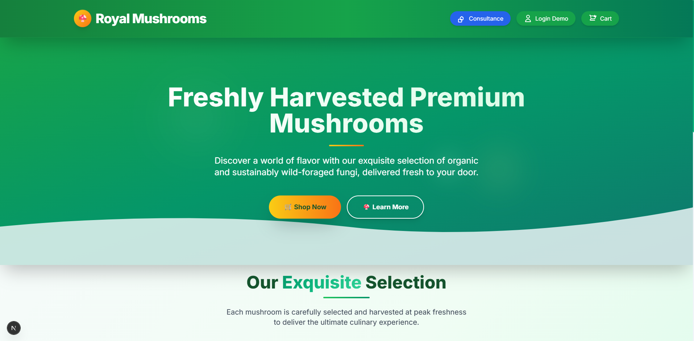
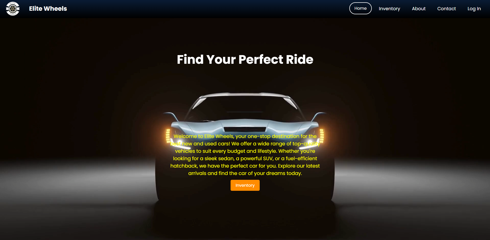

# Hi 👋, I'm Ravindu Wanasinghe!

  

  
  
  

## 🧑‍💼 About Me

🎓 **Information Systems Student** in Sabaragamuwa University of Sri Lanka passionate about coding, problem-solving, and developing innovative solutions  
💻 Exploring the intersection of **technology and business**  
🌱 Currently learning and expanding my skills in **Full Stack Development**  
🚀 Always eager to take on new challenges and learn cutting-edge technologies

---

## 🛠️ Tech Stack

### 💻 Languages

### 🚀 Frameworks & Libraries

### 🗄️ Databases

### ⚙️ Tools & Platforms

---

## 📊 GitHub Stats

  
  

  

---

## 📈 Activity Graph

  

---

## 🏆 GitHub Trophies

  

---

## 🚀 Featured Projects

  
  

---

## 🌟 Fun Facts & Interests

- 🔍 Love exploring new technologies and frameworks
- 🎯 Goal-oriented and always up for a challenge
- 📚 Continuous learner who enjoys problem-solving
- 🌐 Interested in the latest trends in web development
- ⚡ Fun fact: I believe in writing clean, efficient code!

---

## 📫 Connect with Me

  
)

---

  

  <h3>✨ Thanks for visiting my profile! ✨</h3>
  
Let's connect and build something amazing together! 🚀

